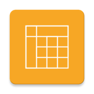

# Lepší rozvrh

Rychlejší a přehlednější klient pro rozvrh systému Bakaláři. Aplikaci jsem vytvořil,
protože mi docházela trpělivost s nepřehledností a hlavně pomalostí oficiální
aplikace.

## Hlavní funkce

- Velmi rychlé zobrazení rozvrhu — Kombinuje offline a online data, aby se rozvrh zobrazil do vteřiny.
- Plynulý offline režim — Lepší rozvrh si všechna načítaná data na pozadí uloží pro použití bez internetu.
- Trvalé upozornění — Kvůli další hodině už aplikaci ani nemusíte otevírat.
- Přehledné rozhraní — Snadné a rychlé přepínání mezi týdny
- Svobodný software — Žádné reklamy, žádné špehování, zdarma a navždy.

## Připravované funkce

- Widget
- Další motivy (tmavý, černobílý, růžovo-fialový s červenými puntíky)
- Vaše návrhy na GitHubu — https://github.com/vitSkalicky/lepsi-rozvrh/issues

## Licence

Lepší rozvrh je *[svobodný software][1]* licencovaný pod licencí [GPLv3][2], což znamená, že

- můžete aplikaci používat jakkoliv chcete
- studovat zdrojový kód a upravovat ho jakkoliv chcete
- sdílet s kýmkoliv chcete
- šířit vaše úpravy, ale musíte zachovat licenci (aby se uchovala svoboda této aplikace)

Pokud se chcete dozvědět více o tom, co *svobodný software* znamená a jaké má výhody, přečtěte si jeho [definici][1].

# Better schedule

This is faster and less confusing schedule client for Bakaláři. I created this app,
because I am annoyed by the slowness of the the official app.

## Main features

- Very fast schedule loading — Combines offline and online data to display schedule within a second.
- Seamless offline mode — Everything is cached in the background so that schedule can be shown even when you are offline.
- Persistent notification — You don't have to open the app to see next lesson any more.
- Simple interface — Easy switching between weeks.
- Free and open source software — No ads, no spying, free, forever.

## Coming soon

- Widget
- More themes (dark, black & white, ...)
- Your suggestions on GitHub — https://github.com/vitSkalicky/lepsi-rozvrh/issues

## Licence

Better Schedule is a *[free software][3]* (not just a freeware) licensed under [GPLv3][2].

# Screenshots

[1]: https://www.gnu.org/philosophy/free-sw.cs.html
[2]: https://www.gnu.org/licenses/gpl-3.0.en.html
[3]: https://www.gnu.org/philosophy/free-sw.en.html